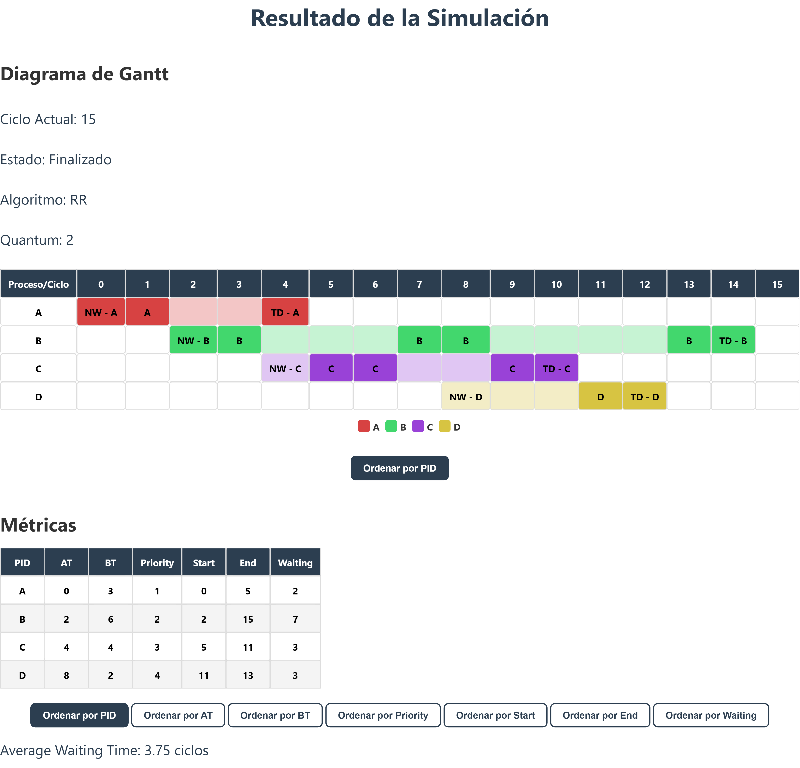
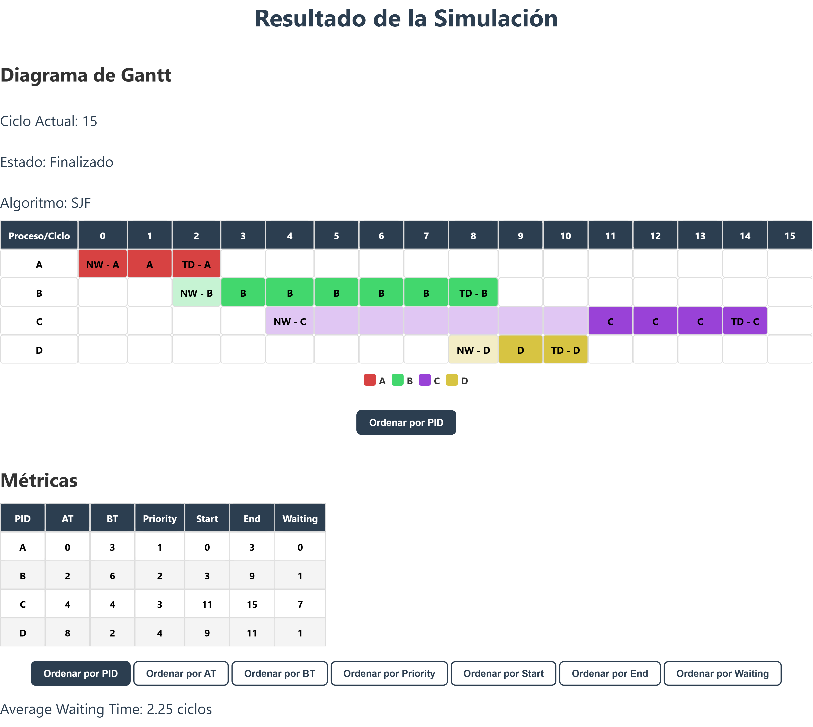

# Simulación de Planificación de Procesos y Mecanismos de Sincronización

## Descripción del Proyecto

Este proyecto se encarga de hacer la simulación de algoritmos de calendarización y sincronización.

Para ambas simulaciones se implementa una interfaz para observar un diagrama de gantt para el avance de la simulación en ciclos consumiendo los procesos.

Para la simulación de calendarización se tienen los algoritmos:

- FIFO (First In, First Out)
- PS (Planificación por Prioridad Preventiva y No Preventiva)
- RR (Round Robin)
- SJF (Shortest Job First)
- SRT (Shortest Remaining Time)

Para la simulación de sincronización se tienen los métodos:

- Semáforos
- Mutex

> **Nota:**
> Los archivos de entrada deben tener nombres que correspondan al tipo de datos que contienen. Por ejemplo:
>
> - `procesos.txt` para los procesos
> - `recursos.txt` para los recursos
> - `acciones.txt` para las acciones
>
> Además, en la carpeta `/data/test` se incluyen archivos de ejemplo para evaluar el comportamiento de los algoritmos. Algunos de ellos son:
>
> - `procesos_fifo.txt`
> - `procesos_ps.txt`
> - `procesos_rr.txt`
> - `procesos_sjf.txt`
> - `procesos_srt.txt`
>
> Es importante **utilizar únicamente el contenido dentro de los archivos** provistos y cada archivo esta diseñado para ver un comportamiento propio del algoritmo, para ver la referencia de donde se obtuvieron estos datos se puede consultar la documentación `.md` de cada algoritmo en [/docs/algoritmos](https://github.com/JosueSay/SchedulerSim/tree/main/docs/algorithms) donde se menciona el enlace de referencia.
>
> Para los datos de sincronización, se incluye un archivo `sincronizacion.txt`, el cual contiene referencias claras al contenido de los archivos `acciones.txt`, `procesos.txt` y `recursos.txt`. Este archivo ha sido diseñado para que el diagrama de Gantt refleje el comportamiento diferenciado entre los métodos de sincronización, **usando exactamente los mismos archivos base**.

## Entorno y Ambiente

- **Sistema operativo (WSL)**: Ubuntu 22.04

- **GCC (Compilador C/C++)**:

  ```bash
  gcc (Ubuntu 11.4.0-1ubuntu1~22.04) 11.4.0
  Copyright (C) 2021 Free Software Foundation, Inc.
  This is free software; see the source for copying conditions.  There is NO
  warranty; not even for MERCHANTABILITY or FITNESS FOR A PARTICULAR PURPOSE.
  ```

- **Python**:

  ```bash
  Python 3.10.12
  ```

## Organización de Carpetas

```bash
SchedulerSim/
├── backend/                # Código de backend en C
│   ├── include/            # Archivos de cabecera (.h)
│   ├── src/                # Archivos fuente (.c)
│   └── Makefile            # Compilación de módulos C
├── frontend/               # Interfaz gráfica en Python
│   ├── assets/             # Recursos gráficos (íconos, estilos)
│   │   ├── css/            # Estilizado de frontend
│   │   ├── images/         # Imágenes usadas en el frontend (iconos)
│   │   └── js/             # Recurso gráfico y preventivo frontend (*.js)
│   ├── templates/          # Plantillas de frontend usado (.html)
│   └── main.py             # Punto de entrada de la aplicación
├── data/                   # Archivos de entrada y salida
│   ├── input/              # Archivos de entrada (.txt)
│   └── output/             # Logs de calendarización y sincronización (.log)
│   └── test/               # Archivos de ejemplo (.txt)
├── docs/                   # Documentación técnica
│   ├── protocolo/          # Protocolo de comunicación C ↔ Python (.md)
│   ├── definitions/        # Explicación de las arquitecturas implementadas (.md)
│   ├── algorithms/         # Explicación algoritmos de calendarización (.md)
│   ├── backend/            # Explicación funcionamiento backend (.md)
│   └── frontend/           # Explicación frontend (.md)
├── images/                 # Outputs de la aplicación
└── README.md
```

## Ejecución del simulador

### Compilación de backend

1. Ir a backend

    ```bash
    cd backend
    ```

2. Compilar archivos fuente

    ```bash
    make clean && make
    ```

### Compilación de frontend

1. Ir a frontend

    ```bash
    cd frontend
    ```

2. Crear entorno virtual y/o instalar librerias

    ```bash
    python3 -m venv venv
    source venv/bin/activate
    ```

    ```bash
    pip install -r requirements
    ```

3. Compilar frontend

    ```bash
    uvicorn main:app --reload --port 8000
    ```

## Consultar Documentación

Se pueden revisar los archivos `.md` mencionados en la estructura del proyecto. Para ver el protocolo implementado, definiciones de estructuras, backend y frontend realizado.

## Entradas del Sistema

### Calendarización

Se espera un archivo `procesos.txt` con los procesos a simular siguiendo la sintaxis:

```bash
<PID>, <BT>, <AT>, <Priority>
```

**Ejemplo:**

```bash
P1, 8, 0, 1
```

### Sincronización

Se espera tres archivos `.txt` con la sintaxis mencionada a continuación y con el nombre correspondiente al contenido de archivo (procesos, acciones o recursos):

1. Procesos:

   1.1 Sintaxis:

      ```bash
      <PID>, <BT>, <AT>, <Priority>
      ```

   1.2 Ejemplo:

    ```bash
    P1, 8, 0, 1
    ```

2. Acciones:

   2.1 Sintaxis:

      ```bash
      <PID>, <ACCION>, <RECURSO>, <CICLO>
      ```

   2.2 Ejemplo:

      ```bash
      P1, READ, R1, 0
      ```

2. Recursos:

   3.1 Sintaxis:

      ```bash
      <NOMBRE RECURSO>, <CONTADOR>
      ```

   3.2 Ejemplo:

      ```bash
      R1, 1
      ```

## Salidas del Sistema

Se debe poder observar el diagrama de gantt con métricas y para visualizar los logs de los eventos se pueden observar en `/data/output/*.log` tanto para simulación por sincronización como por calendarización.

En este caso el diagrama de gantt se podrá descargar un screenshot sobre la pantalla de resultados y guardarlas. Algunos ejemplos pueden verse en `/images/*.png`.

### Ejemplo de salidas

#### Algoritmo FIFO (First In, First Out)


#### Algoritmo PS (Planificación por Prioridad Preventiva)


#### Algoritmo PS (Planificación por Prioridad No Preventiva)


#### Algoritmo RR (Round Robin con quantum 2)



#### Algoritmo SJF (Shortest Job First)



#### Algoritmo SRT (Shortest Remaining Time)


#### Sincronización con Semáforos


#### Sincronización con Mutex


