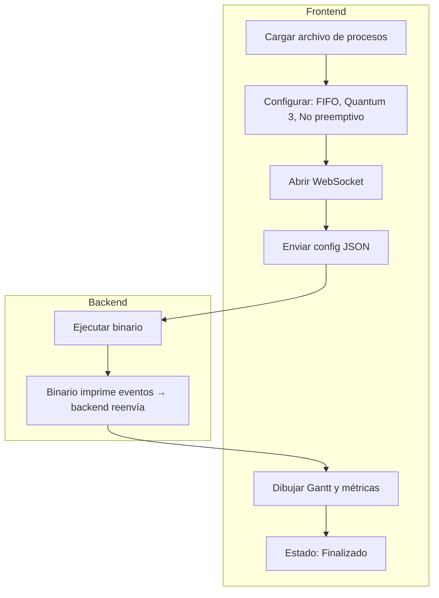

# Protocolo de Comunicación – SchedulerSim (Backend/Frontend)

Este documento describe el protocolo de comunicación entre el **frontend web** y el **backend FastAPI** para la simulación de algoritmos de planificación de procesos tipo Gantt.

| Componente              | Rol                                            |
| ----------------------- | ---------------------------------------------- |
| **Frontend**            | Envía configuración y renderiza resultados     |
| **Backend**             | Orquesta binario, reenvía eventos, guarda logs |
| **Simulador (binario)** | Ejecuta simulación y emite eventos JSON        |

## Flujo General



### 1. Cliente (Frontend)

El **cliente** (interfaz frontend) se encarga de establecer la comunicación con el backend y mostrar los resultados de la simulación. Sus responsabilidades se agrupan de la siguiente manera:

#### Conexión WebSocket

* Se conecta al endpoint:
  `/ws/simulation-scheduling`
* Envía una configuración inicial en formato JSON que incluye:

  * Algoritmo de planificación (por ejemplo: FIFO)
  * Quantum
  * Si es o no preemptivo

#### Comunicación con el Backend

* Escucha mensajes JSON que contienen:

  * Eventos de ejecución (`state`)
  * Métricas por proceso (`PROCESS_METRIC`)
  * Finalización de la simulación (`SIMULATION_END`)

#### Visualización de Resultados

* Muestra en la interfaz:

  * Diagrama de Gantt
  * Tabla de métricas por proceso
  * Tiempo de espera promedio

### 2. Servidor (Backend)

El **servidor** se encarga de recibir la configuración del cliente, ejecutar el simulador y reenviar los resultados al frontend a través de WebSocket.

#### Conexión y Ejecución

* Acepta la conexión WebSocket.
* Recibe la configuración del cliente en formato JSON.
* Ejecuta el binario `scheduling-simulator`, pasando la configuración por `stdin`.
* Lee línea por línea la salida `stdout` del simulador.
* Reenvía cada línea JSON válida al cliente vía WebSocket.
* Guarda toda la salida en `data/output/scheduling_simulator.log`.

#### Funciones clave en el Backend

* `websocketSimulationScheduling`:

  * Acepta la conexión WebSocket.
  * Lanza el binario `scheduling-simulator`.
  * Redirige `stdin`, lee `stdout`.
  * Reenvía líneas JSON al cliente.
  * Cierra la conexión tras recibir `SIMULATION_END`.

* `uploadFiles`:

  * Guarda archivos de entrada `.txt` en `../data/input`.

* `getEnvironment`:

  * Retorna si está en entorno `dev` o `prod`.

#### Binario C (`scheduling-simulator`)

Compilado mediante `Makefile` y ubicado en:

```bash
../backend/backend/bin/scheduling-simulator
```

* Recibe un JSON por `stdin`.
* Imprime por `stdout` los eventos de simulación y métricas.
* Su salida es leída por el backend y reenviada al frontend.

## Inputs

Los inputs se envían como JSON por WebSocket.

```json
{
  "algorithm": "FIFO",
  "quantum": 3,
  "isPreemptive": false
}
```

Estos datos son redirigidos por el backend al simulador compilado (`backend/bin/scheduling-simulator`) por `stdin`.

Además, el simulador utiliza como entrada el archivo con los procesos enviados por el frontend y almacenados en:

* **Entrada**: `../data/input/procesos.txt`

## Outputs

Los outputs son eventos JSON impresos por el binario en `stdout`. El backend los reenvía al frontend si son válidos.

* **Salida**: `../data/output/scheduling_simulator.log`
* **Ruta WebSocket**: `/ws/simulation-scheduling`

### Ejemplos

#### Eventos de simulación por ciclo

```json
{ "pid": "A", "startCycle": 1, "endCycle": 2, "state": "ACCESSED" }
```

* `pid`: ID del proceso
* `startCycle` - `endCycle`: intervalo de ejecución
* `state`: `NEW`, `WAITING`, `ACCESSED`, `TERMINATED`

#### Métricas por proceso

```json
{
  "event": "PROCESS_METRIC",
  "pid": "A",
  "arrivalTime": 1,
  "burstTime": 3,
  "priority": 2,
  "startTime": 7,
  "endTime": 10,
  "waitingTime": 6
}
```

#### Tiempo promedio total

```json
{ "type": "metrics", "Average Waiting Time": 5.25 }
```

#### Evento de finalización

```json
{ "event": "SIMULATION_END" }
```

#### Estructura del Log (`data/output/scheduling_simulator.log`)

Este es el reflejo del retorno de backend para debugging capturado por frontend al ejecutar el archivo binario `backend/bin/scheduling-simulator`.

```bash
[STDOUT] Algoritmo: FIFO | Quantum: 3 | Preemptivo: No
[STDOUT] === Procesos Cargados (4) ===
[STDOUT] PID: A, BT: 3, AT: 1, Priority: 2, State: NEW
...
[STDOUT] {"pid": "A", "startCycle": 1, "endCycle": 2, "state": "ACCESSED"}
[STDOUT] {"event": "PROCESS_METRIC", ...}
[STDOUT] {"event": "SIMULATION_END"}
```
