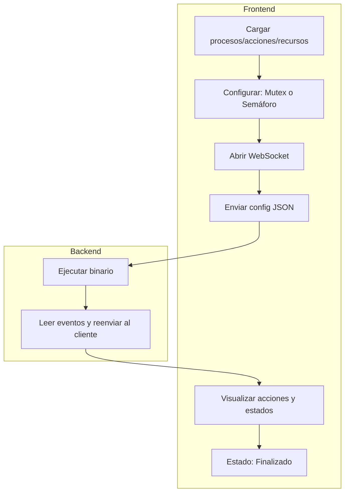

# Protocolo de Comunicación – SyncSim (Backend/Frontend)

Este documento describe el protocolo de comunicación entre el **frontend web** y el **backend FastAPI** para la simulación de mecanismos de sincronización como **mutex** o **semáforos**.

| Componente              | Rol                                                |
| ----------------------- | -------------------------------------------------- |
| **Frontend**            | Envía configuración, muestra estados y resultados  |
| **Backend**             | Orquesta ejecución del binario, reenvía eventos    |
| **Simulador (binario)** | Ejecuta la simulación y emite eventos JSON en vivo |

## Flujo General



## 1. Cliente (Frontend)

### Conexión WebSocket

* Endpoint: `/ws/simulation-sync`
* Envía configuración inicial JSON:

  ```json
  {
    "mechanism": "mutex"
  }
  ```

### Comunicación

* Escucha eventos JSON:

  * Cambios de estado y acción de procesos
  * Métricas por proceso
  * Evento de finalización

### Visualización

* Representa:

  * Línea de tiempo de acceso/bloqueo a recursos
  * Estado de procesos por ciclo
  * Métricas de sincronización

## 2. Servidor (Backend)

### Funcionalidad

* Acepta conexión WebSocket
* Guarda archivos `.txt` en `../data/input/`
* Ejecuta binario `sync-simulator`
* Redirige `stdin`/`stdout`
* Reenvía eventos JSON al frontend
* Log completo en `data/output/sync_simulator.log`

### Funciones

* `websocketSimulationSync()`: gestión completa de WebSocket y binario
* `uploadFiles()`: guarda `procesos.txt`, `acciones.txt`, `recursos.txt`

### Binario en C

Ubicación: `../backend/backend/bin/sync-simulator`

* Entrada por `stdin` (JSON config)
* Entrada por archivos `.txt`
* Salida por `stdout` en JSON

## Inputs

```json
{
  "mechanism": "mutex"
}
```

Además, archivos necesarios en `../data/input/`:

* `procesos.txt`
* `recursos.txt`
* `acciones.txt`

## Outputs

### Eventos de Simulación

```json
{
  "pid": "A",
  "startCycle": 0,
  "endCycle": 1,
  "state": "ACCESSED",
  "action": "READ"
}
```

* `state`: `NEW`, `WAITING`, `ACCESSED`, `TERMINATED`, `OMITED`
* `action`: `READ`, `WRITE`, `NONE`

### Métricas por Proceso

```json
{
  "event": "PROCESS_METRIC",
  "pid": "A",
  "arrivalTime": 0,
  "burstTime": 6,
  "burstTimeConsumed": 4,
  "burstTimePending": 2,
  "priority": 1,
  "startTime": 0,
  "endTime": 5,
  "waitingTime": 1
}
```

### Métricas Globales

```json
{
  "type": "metrics",
  "Average Waiting Time": 0.40
}
```

### Finalización

```json
{ "event": "SIMULATION_END" }
```

## Logs (`sync_simulator.log`)

Reflejan:

* Configuración usada
* Procesos, acciones, recursos cargados
* Eventos JSON emitidos por el simulador

```bash
[STDOUT] {"event": "CONFIG", "mechanism": "mutex"}
[STDOUT] {"pid": "A", "startCycle": 0, "endCycle": 1, "state": "ACCESSED", "action": "READ"}
...
[STDOUT] {"event": "SIMULATION_END"}
```
